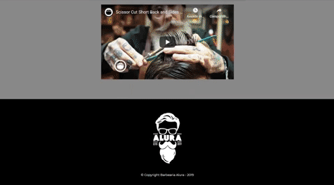

# 🤵 Barbearia Alura

  

## 👨‍💻 Sobre o projeto
 

  

 A Barbearia Alura é um projeto do curso básico de HTML & CSS na plataforma de cursos online Alura, visando um código semântico e bem estruturado.
 
 ## 📄 Licença

O projeto está sob a licença MIT, saiba mais em:

[LICENSE](https://pt.wikipedia.org/wiki/Licen%C3%A7a_MIT)

---

Feito com ❤️ por Daniel Pádua
